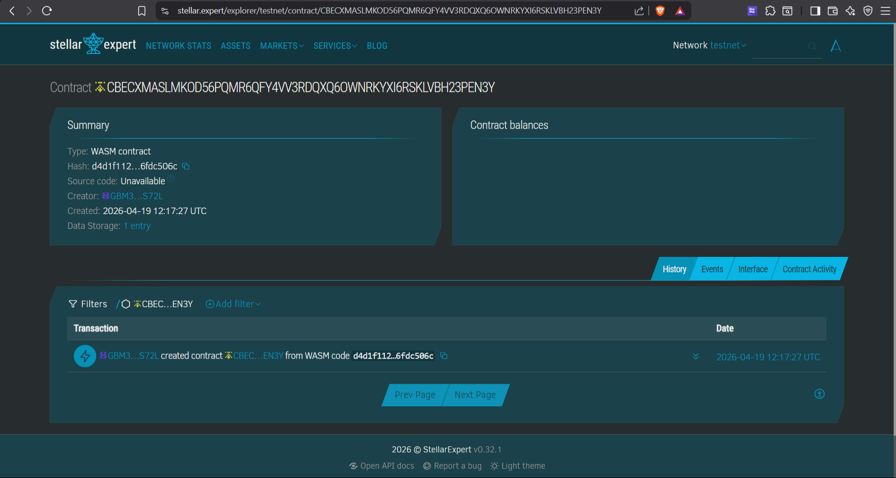

# The On-Chain Status
A Full Stack Web3 application built using Stellar Soroban and Next.js. This application allows users to set a personalized string status bound to their wallet address on the blockchain and look up the statuses of others.

## Project Structure
- `contracts/status`: Rust source code for the Soroban smart contract.
- `frontend`: The Next.js application integrated with `@stellar/freighter-api` and `@stellar/stellar-sdk`.

## 🛠️ CLI Guide: Contract Workflow
Ensure you have the `stellar-cli` mounted/installed and `rustc` configured for the `wasm32-unknown-unknown` target.

### 1. Build the Contract
Navigate to the project root and build the contract into a `.wasm` file:
```bash
stellar contract build
```
This will produce a `.wasm` file at `target/wasm32-unknown-unknown/release/status.wasm`.

### 2. Deploy to Testnet
Ensure you have a network and identity configured for Testnet. First, generate an identity and fund it:
```bash
stellar keys generate alice
stellar keys fund alice --network testnet
```

Then deploy the contract to the network:
```bash
stellar contract deploy \
  --wasm target/wasm32-unknown-unknown/release/status.wasm \
  --source alice \
  --network testnet
```

*Note the Contract ID returned by this command. You will need to paste it into your `frontend/.env.local` file.*

## 💻 Running the Frontend
Navigate into the `frontend` directory:
```bash
cd frontend
```

Install dependencies (if not already installed):
```bash
npm install
```

Configure Environment Variables:
Copy or modify `.env.local` within the `frontend` folder and paste the Contract ID you got from Step 2:
```bash
NEXT_PUBLIC_SOROBAN_RPC_URL="https://soroban-testnet.stellar.org"
NEXT_PUBLIC_SOROBAN_NETWORK="TESTNET"
NEXT_PUBLIC_CONTRACT_ID="<PASTE_YOUR_CONTRACT_ID_HERE>"
```

Run the development server:
```bash
npm run dev
```

Open [http://localhost:3000](http://localhost:3000) with your browser to see the result. You must have the [Freighter browser extension](https://freighter.app/) installed to submit transactions.

And My contract Address "CBECXMASLMKOD56PQMR6QFY4VV3RDQXQ6OWNRKYXI6RSKLVBH23PEN3Y"

